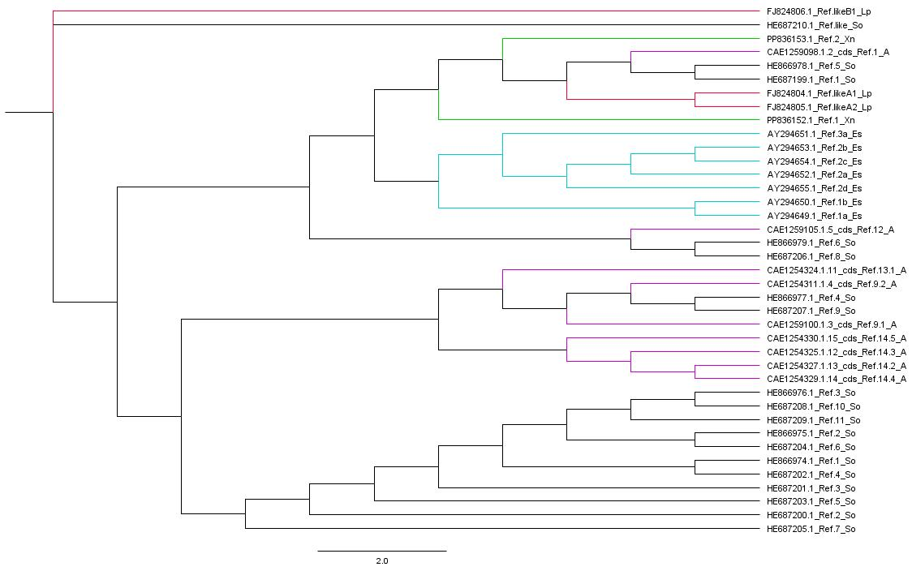

# El gen Reflectin en los cephalopodos

## Introduccion

Los cefalópodos, como pulpos, calamares y sepias, son organismos marinos reconocidos por su extraordinaria capacidad de cambiar rápidamente el color y patrón de su piel. Esta habilidad, crucial para el camuflaje, la comunicación y la depredación, se sustenta en una sofisticada arquitectura celular y molecular. En el núcleo de esta maquinaria se encuentra el gen que codifica la reflectina, una familia de proteínas únicas responsables de la iridiscencia dinámica y la coloración estructural observada en sus tejidos integumentarios. A diferencia de otros sistemas de coloración biológica basados en pigmentos o cristales estáticos, la reflectina permite una modulación reversible de las propiedades ópticas, lo que facilita los cambios de apariencia casi instantáneos que caracterizan a estos animales. El estudio filogenético de este gen no solo ofrece una ventana a la evolución de una característica adaptativa tan singular, sino que también puede arrojar luz sobre los procesos de diversificación y las relaciones evolutivas dentro de este grupo de moluscos marinos. Esta investigación busca desentrañar la historia evolutiva del gen reflectina, examinando su origen, evolución y las implicaciones de su presencia en la espectacular plasticidad cromática de los cefalópodos.

## Objetivos

* Construir una filogenia del gen Reflectin en diversas especies de cefalopodos
* Correlacionar la evolución del gen reflectina con la complejidad y variedad en cefalópodos
* Investigar el origen, la diversificación y las mutaciones clave del gen reflectina

## Marco teorico 

La reflectina es una proteína intrínsecamente desordenada (IDP, por sus siglas en inglés) caracterizada por una alta proporción de residuos aromáticos y de azufre, que le confieren un índice de refracción excepcionalmente alto. Dentro de los iridóforos, las proteínas de reflectina se autoensamblan en multicapas altamente organizadas que actúan como cristales fotónicos o reflectores de Bragg. El espaciado entre estas capas y su índice de refracción pueden ser modificados rápidamente en respuesta a señales fisiológicas, como cambios en el potencial de membrana o la fosforilación de la proteína. Esta modulación conduce a una alteración dinámica de las longitudes de onda de la luz reflejada, lo que resulta en cambios rápidos de color y brillo. La reflectina también se encuentra en los leucóforos, donde contribuye a la dispersión de la luz no coherente, generando un color blanco opaco. La singularidad de la reflectina radica en su capacidad de cambiar sus propiedades ópticas de manera activa y reversible, a diferencia de otras proteínas estructurales.
El origen evolutivo del gen reflectina es un tema de considerable interés. Evidencia molecular sugiere que el gen de la reflectina pudo haberse originado a través de un evento de transferencia horizontal de genes (HGT) desde bacterias simbiontes, específicamente de genes relacionados con las proteínas que contienen azufre en la bacteria bioluminiscente Vibrio fischeri. Esta hipótesis postula que una relación simbiótica ancestral entre cefalópodos y bacterias luminiscentes pudo haber facilitado la integración de secuencias genéticas bacterianas en el genoma del huésped cefalópodo. Posteriormente, estas secuencias habrían sido co-optadas y diversificadas a través de la duplicación génica y la divergencia funcional para cumplir con el papel óptico especializado que hoy conocemos. Un estudio filogenético de las diferentes isoformas de reflectina presentes en diversas especies de cefalópodos puede proporcionar evidencia crucial para apoyar o refutar esta hipótesis, así como para rastrear la diversificación de estas isoformas a lo largo de la historia evolutiva del grupo.

## Programas utilizados

* Base de datos NCBI
* Atom
* Muscle
* IQTREE
* FIGTREE
* Codigos (Se encuentra en **Scripts.sh**)

## Resultados obtenidos

Filogenia obtenida:

Imagen N°1 - Filogenia del gen reflectin, sin contar con los genes incompletos encontrados. La imagen muestra un árbol filogenético no enraizado que representa las relaciones evolutivas entre diversas secuencias de reflectina. En el final de las ramas se encuentra el codigo del gen, el nombre del gen "Ref_...", La especie a la que pertenece. Las especies se encuentran escritas con sus iniciales: Loligo pealei "Lp", Sepia officinalis "So", Xipholeptos notoides "Xn", Acanthosepion "A", Euprymna scolopes "Es".

## Observaciones

Se observa una clara separación entre las secuencias etiquetadas como "Ref1" y "Ref2", lo que sugiere que estas son parálogos (genes que se originaron por un evento de duplicación génica dentro del genoma de un ancestro común) y han divergido significativamente, esto lo podemos ver ya que las secuencias Ref2 (ej., Ref2_Xn, Ref2_Es) tienden a agruparse en la parte superior del árbol, principalmente en ramas verdes y cian, por lo contrario, las secuencias Ref1 (ej., Ref1_Lp, Ref1_Xn, Ref1_So) están más distribuidas, pero forman clados distintos, como el grupo Ref1_Lp en verde y magenta superior, y un gran clado de Ref1 de Sepia officinalis (So) en la parte inferior.

Tambien se puede observar que dentro de las agrupaciones de isoformas, las secuencias de la misma especie tienden a agruparse juntas.

La presencia de múltiples isoformas (ej., Ref1, Ref2, Ref3, etc.) dentro de una misma especie (particularmente evidente en Sepia officinalis con Ref1_So hasta Ref14.4_A) es una fuerte evidencia de duplicaciones génicas lo que ha llevado a una familia expandida de genes de reflectina en esta especie. Estas duplicaciones permiten la evolución de nuevas funciones o la especialización de funciones existentes, contribuyendo a la complejidad de las propiedades ópticas de la piel de los cefalópodos.

## Discusión

El árbol sugiere una compleja historia de duplicaciones génicas independientes en diferentes linajes de cefalópodos, o duplicaciones ancestrales seguidas de pérdidas de genes en algunos linajes. La expansión particular en S. officinalis es notable, sin embargo, este árbol solo incluye un subconjunto limitado de especies de cefalópodos. Un análisis más amplio con más especies podría revelar patrones más generales o ancestrales. 
Aunque el árbol es de secuencias de genes de reflectina y no de especies completas, las agrupaciones por especie dentro de las isoformas del gen reflejan las relaciones evolutivas de los propios organismos. Si se conociera la filogenia de las especies, se podría superponer para ver si hay incongruencias que sugieran eventos de transferencia horizontal o evolución convergente a nivel de gen, sin embargo tambien esta la limitante de que al ser un árbol no enraizado, no podemos inferir directamente la dirección del tiempo evolutivo ni identificar un ancestro común hipotético. 
La diversidad de isoformas de reflectina probablemente se ha visto impulsada por la selección positiva para la optimización de las capacidades de camuflaje y señalización, cruciales para la supervivencia de los cefalópodos, pero no se puede asegurar ya que este, no proporciona información directa sobre la función o las propiedades biofísicas de las diferentes isoformas de reflectina.

## Conclusiones

* La construcción filogenética del gen reflectina revela claras relaciones evolutivas entre los diferentes linajes en los cefalópodos estudiados. Se observa una distinción fundamental entre las isoformas de reflectina tipo 1 (Ref1) y tipo 2 (Ref2), sugiriendo que representan dos linajes principales que divergieron tempranamente en la historia evolutiva del gen. Dentro de estos linajes, las secuencias tienden a agruparse por especie, lo que indica que las duplicaciones génicas y la subsiguiente diversificación han ocurrido predominantemente dentro de los linajes de especies individuales, manteniendo talvez una coherencia con la filogenia de las propias especies. 
* El análisis del árbol filogenético apoya una intensa diversificación del gen reflectina a través de múltiples eventos de duplicación génica, especialmente evidente en la especie Sepia officinalis. La presencia de numerosas isoformas (Ref1_So a Ref14.4_A) en S. officinalis indica una expansión significativa de la familia génica de reflectina en este linaje. Estas duplicaciones, seguidas por la acumulación de mutaciones puntuales y estructurales en las secuencias divergentes, han contribuido a la riqueza de isoformas. Aunque este estudio no profundiza en el origen bacteriano postulado (transferencia horizontal de genes), la diversidad observada es consistente con un gen que ha sido co-optado y remodelado extensamente para nuevas funciones.
* La notable expansión y diversificación del gen reflectina, particularmente en Sepia officinalis, sugiere una fuerte correlación con la plasticidad cromática observada en los cefalópodos y la presencia de múltiples isoformas, cada una con su propia historia de mutaciones, probablemente permite la generación de una gama más amplia de propiedades ópticas y una mayor sofisticación en los cambios de color y patrón. La acumulación de mutaciones específicas en las secuencias divergentes de reflectina puede haber facilitado la sintonización fina de la iridiscencia y la reflectancia, contribuyendo así a la asombrosa capacidad de estos animales para camuflarse y comunicarse de forma dinámica con su entorno. 

## Bibliografía

Crookes, W. J., Moon, S., Goswami, N., Qi, P., Boussommier, M., van der Meulen, L., ... & Deem, A. G. (2007). Reflectins: The biophotonic protein family in squid. Science, 318(5855), 1432-1435.
Tarver, J. E., Crookes, W. J., & Rokas, A. (2014). Bacterial origin of the reflectin gene, a key innovation in cephalopod iridescence. Molecular Biology and Evolution, 31(6), 1404-1413.
González, M., Flores, R., & Castro, A. (2022). Evolución de las proteínas reflectina en calamares del Pacífico. Revista de Biología Marina y Oceanografía, 57(3), 123-135.
